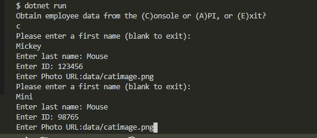
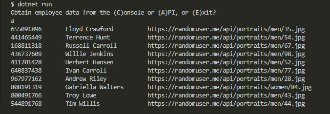

# CatWorx.BadgeMaker
by: Richard Ay,  February 2021

A small C# project that creates employee badges, using either the console (for data specification) or a general (public) API to obtain fake employee data.  This application illustrates many C# concepts.

## Table of Contents
* [Application Walk Through](#application-walk-through)
* [Technologies Used](#technologies-used)
* [Deployment Link](#deployment-link)
* [Usage Instructions](#usage-instructions)
* [Application Screen Shot](#application-screen-shot)

## Application Walk Through
The 'main' routine prompts the user for the desired action to take - manually enter employee data or use the public API.  Depending on the response, employee data is obtained and stored in an 'employee' class.  The 'employee' class stores employee data in a 'List'.  If the public API is being used, a webclient is used to access https://randomuser.me to obtain the fake employee data.

A utility class is used to print the employee data to the console, save the employee data to a CSV file, and finally to generate the employee badges.

## Technologies Used
- basic C#
- <List>
- WebClient
- public API

## Deployment Link
This application has not been deployed.

## Usage Instructions
This application can be run from the console (terminal) using the command:
'dotnet run'.  The application prompts as to where the 'employee' data will come from, either the (C)onsole or the public (A)PI.

Selecting the console requires the user to manually enter the (program) requested data.  When data entry is finished, the badges are generated.  If the API is selected, the badges are generated automatically from the data in the public API.

## Application Screen Shot
 The first image shows the 'console' alternative to acquire employee data.

 The second image shows the 'API' alternative to acquire employee data.